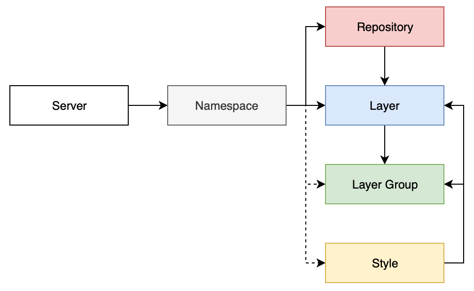

# MAGIC Web Map Inventory

Inventory of geospatial layers and web maps provided by the BAS Mapping and Geographic Information Centre (MAGIC), 
visualised in Airtable.

[View inventory in Airtable](https://airtable.com/tblr6gwKOLQelMXDv/viwp8xVwcRRJnoIo0?blocks=hide) (internal).

See [Data model](#data-model) for more about the information this inventory holds.

## Usage

This project runs locally in a container. See the [Setup](#setup) section for instructions.

To run tasks:

```shell
$ docker-compose run flask [task]
```

When finished, run `docker-compose down` to remove all running containers.

### Tasks

#### `data fetch`

Fetches information about servers, namespaces, repositories, styles, layers and layer groups from servers configured in
`resources/sources.json`. Fetched information is saved to an output data file, `resources/data.json`.

**Note:** Currently this task results in new IDs being generated for each resource, even if it already exists. This will
lead to resources being removed and re-added unnecessarily but will always remain internally consistent. 

#### `airtable status`

Checks local items against Airtable to check whether they are up-to-date (current), outdated, missing or orphaned.

#### `airtable sync`

Creates, updates or removes items in Airtable to match local items.

#### `airtable reset`

Removes all data from Airtable.

### Adding data sources

**Note:** See [Supported data sources](#supported-data-sources) for currently supported data sources.

Each data source is represented as an object in the `server` list in `resources/sources.json`. The structure of this
object depends on the server/source type, defined below. Once added use the [`data fetch` task](#data-fetch).

#### Adding a *GeoServer* data source

| Property   | Required | Data Type | Allowed Values                                                      | Example Value                | Description                          | Notes                         |
| ---------- | -------- | --------- | ------------------------------------------------------------------- | ---------------------------- | ------------------------------------ | ----------------------------- |
| `id`       | Yes      | String    | A *ULID* (Universally Unique Lexicographically Sortable Identifier) | `01DRS53XAJNH0TNBW5161B6EWJ` | Unique identifier for server/source  | See below for how to generate |
| `label`    | Yes      | String    | Any combination of *a-Z*, *A-Z*, *0-9*, *-*, *_*                    | `a-1_A`                      | Using a short, well-known identifier | -                             |
| `hostname` | Yes      | String    | Any valid hostname                                                  | `example.com`                | -                                    | -                             |
| `type`     | Yes      | String    | `geoserver`                                                         | *See allowed value*          | -                                    | -                             |
| `port`     | Yes      | String    | Any valid port number                                               | `8080`                       | -                                    | Usually `80` or `8080`        |
| `api-path` | Yes      | String    | `/geoserver/rest`                                                   | *See allowed value*          | Defined by GeoServer                 | -                             |
| `wms-path` | Yes      | String    | `/geoserver/ows?service=wms&version=1.3.0&request=GetCapabilities`  | *See allowed value*          | Defined by GeoServer                 | -                             |
| `wfs-path` | Yes      | String    | `/geoserver/ows?service=wfs&version=2.0.0&request=GetCapabilities`  | *See allowed value*          | Defined by GeoServer                 | -                             |
| `username` | Yes      | String    | Any valid GeoServer username                                        | `admin`                      | Usually the GeoServer admin user     | -                             |
| `password` | Yes      | String    | Password for GeoServer user                                         | `password`                   | Usually the GeoServer admin user     | -                             |

**Note:** Visit [ulidgenerator.com](http://ulidgenerator.com) to generate ULIDs manually.

Example:

```json
{
  "id": "xxx",
  "label": "example",
  "hostname": "example.com",
  "type": "geoserver",
  "port": "80",
  "api-path": "/geoserver/rest",
  "wms-path": "/geoserver/ows?service=wms&version=1.3.0&request=GetCapabilities",
  "wfs-path": "/geoserver/ows?service=wfs&version=2.0.0&request=GetCapabilities",
  "username": "admin",
  "password": "password"
}
```

## Implementation

Simple Flask application using the [airtable-python-wrapper](https://airtable-python-wrapper.readthedocs.io) library to 
interact with the Airtable API.

Data is synced to the 
[MAGIC Maps and Layers Inventory](https://airtable.com/tblCoGkVssEe6cs0B/viwjb9FAq2FLx5BL9?blocks=hide) Base in the
[BAS MAGIC](https://airtable.com/wspXVL8SsiS5hPhob/workspace/billing) Airtable Workspace.

### Configuration

Configuration options are set within `map_layer_index/config.py`. Variable options are set using 
[Environment variables](#environment-variables).

#### Environment variables

Variable configuration options should be set using environment variables. These can be real environment variables or 
defined in a `.env` file, for which `.env.example` acts as an example.

### Data model

This project, an inventory, consists of information held in geospatial services. The data model is intended to be 
generic to support different data sources and technologies.

This data model consists of:

* **Servers**: Represent a source of geospatial information, such as an instance of a technology or a whole platform
* **Namespaces**: Represent a logical grouping of resources within a server/endpoint
* **Repositories**: Represent a data source that backs one or more layers
* **Styles**: Represent a definition for how data in a layer should be represented/presented
* **Layers**: Represent a logical unit of geospatial information
* **Layer Groups**: Represent a logical grouping of one or more layers that should be treated as a single, indivisible 
  unit

It can be visualised as:



### Supported data sources

* GeoServer
    * Using a combination of its admin API and WMS/WFS OGC endpoints

## Setup

```shell
$ git clone https://gitlab.data.bas.ac.uk/MAGIC/web-map-inventory
$ cd map-layer-index
```

Docker and Docker Compose are required to setup a local development environment of this app.

This project depends on private images from the BAS Docker Registry 
(part of [gitlab.data.bas.ac.uk](https://gitlab.data.bas.ac.uk)).

```shell
# login if this is the first time you've used this registry
$ docker login docker-registry.data.bas.ac.uk
$ docker-compose pull
```

An environment file, `.env`, is used for setting secret variables. `.env.example` acts as a guide to copy and be updated 
as needed.

```shell
$ cp .env.example .env
```

**Note:** You will need an Airtable API token with permission to modify the relevant 
[Base](https://airtable.com/tblCoGkVssEe6cs0B).

A data sources file, `resources/sources.json`, is used for setting servers to fetch data (layers, etc.) from. 
`resources/sources.example.json` acts as a guide to copy and be updated as needed.

```shell
$ cp resources/sources.example.json resources/sources.json
```

**Note:** You will need suitable credentials for the APIs of each server (e.g. an admin user for GeoServer server).

See the [Usage](#usage) section for how to use the application.

## Development

This project is developed as a Flask application.

Ensure `.env.example` is kept up-to-date if any relevant configuration options are added or changed.

Ensure all 1st party code has [unit/integration tests](#testing) as appropriate.

### Code Style

PEP-8 style and formatting guidelines must be used for this project, with the exception of the 80 character line limit.

[Flake8](http://flake8.pycqa.org/) is used to ensure compliance, configured in `.flake8`.

To run checks manually:

```shell
$ docker-compose run app flake8 .
```

Checks are ran automatically in [Continuous Integration](#continuous-integration).

### Dependencies

Python dependencies should be defined using Pip through the `requirements.txt` file. The Docker image is configured to
install these dependencies into the application image for consistency across different environments. Dependencies should
be periodically reviewed and updated as new versions are released.

To add a new dependency:

```shell
$ docker-compose run app ash
$ pip install [dependency]==
# this will display a list of available versions, add the latest to `requirements.txt`
$ exit
$ docker-compose down
$ docker-compose build
```

If you have access to the [BAS GitLab instance](https://gitlab.data.bas.ac.uk), push the rebuilt Docker image to the 
BAS Docker Registry:

```shell
# login if this is the first time you've used this registry
$ docker login docker-registry.data.bas.ac.uk

$ docker-compose push
```

### Static security scanning

To ensure the security of this API, source code is checked against [Bandit](https://github.com/PyCQA/bandit) for issues 
such as not sanitising user inputs or using weak cryptography. Bandit is configured in `.bandit`.

**Warning:** Bandit is a static analysis tool and can't check for issues that are only be detectable when running the 
application. As with all security tools, Bandit is an aid for spotting common mistakes, not a guarantee of secure code.

To run checks manually:

```shell
$ docker-compose run app bandit -r .
```

Checks are ran automatically in [Continuous Integration](#continuous-integration).

### Logging

Use the Flask default logger. For example:

```python
app.logger.info('Log message')
```

When outside of a route/command use `current_app`:

```python
from flask import current_app

current_app.logger.info('Log message')
```

### Editor support

#### PyCharm

A run/debug configuration, *App*, is included in the project.

## Testing

### PyTest

This project uses [PyTest](https://docs.pytest.org/en/latest/) for unit/integration testing. Tests are defined in 
`tests/`.

To run tests manually:

```shell
$ docker-compose run app pytest
```

Tests can also be ran manually in PyCharm using the included *App (Integration)* run/debug configuration.

Checks are also ran automatically in [Continuous Integration](#continuous-integration).

### Continuous Integration

All commits will trigger a Continuous Integration process using GitLab's CI/CD platform, configured in `.gitlab-ci.yml`.

## Distribution

This service is distributed as a Python package hosted on [PyPi](https://pypi.org/project/bas-web-map-inventory).

Source and binary packages are built automatically through [Continuous Deployment](#continuous-deployment).

To build them manually:

```shell
$ docker-compose run app ash
# build package to /build, /dist and /bas-web-map-inventory.egg-info
$ python setup.py sdist bdist_wheel
# quit and remove container
$ exit
$ docker-compose down
``` 

To manually publish a pre-release version to [PyPi Testing](https://test.pypi.org/project/bas-web-map-inventory):

**Note:** Before publishing, ensure you set `version` in `setup.py` to a suitable version, e.g. `1.2.3-rc1`.

```shell
$ docker-compose run app ash
$ python -m twine upload --repository-url https://test.pypi.org/legacy/ dist/*
# quit and remove container
$ exit
$ docker-compose down
```

To manually publish a release version to [PyPi](https://pypi.org/project/bas-web-map-inventory):

**Note:** Before publishing, ensure you set `version` in `setup.py` to a suitable version, e.g. `1.2.3`.

```
$ docker-compose run app ash
$ python -m twine upload --repository-url https://pypi.org/legacy/ dist/*
# quit and remove container
$ exit
$ docker-compose down
```

## Deployment

### Continuous Deployment

All commits will trigger a Continuous Deployment process using GitLab's CI/CD platform, configured in `.gitlab-ci.yml`.

...

## Release procedure

### At release

For all releases:

1. create a release branch
2. if needed, build & push the Docker image
3. check the `version` in `setup.py` is set to a suitable semver version, e.g. `1.2.3-rc1`
4. close release in `CHANGELOG.md`
5. push changes, merge the release branch into `master` and tag with version

The application will be built and pushed to PyPi using [Continuous Deployment](#continuous-deployment).

### After release

For all releases:

1. update the version number in `setup.py` as appropriate

## Feedback

The maintainer of this project is the BAS Mapping and Geographic Information Centre (MAGIC), they can be contacted at: 
[servicedesk@bas.ac.uk](mailto:servicedesk@bas.ac.uk).

## Issue tracking

This project uses issue tracking, see the 
[Issue tracker](https://gitlab.data.bas.ac.uk/MAGIC/web-map-inventory/issues) for more information.

**Note:** Read & write access to this issue tracker is restricted. Contact the project maintainer to request access.

## License

© UK Research and Innovation (UKRI), 2019, British Antarctic Survey.

You may use and re-use this software and associated documentation files free of charge in any format or medium, under 
the terms of the Open Government Licence v3.0.

You may obtain a copy of the Open Government Licence at http://www.nationalarchives.gov.uk/doc/open-government-licence/
